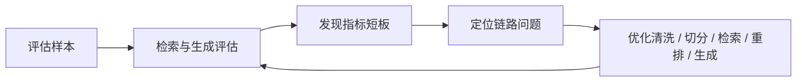

# 小东开店助手

> 面向平台招商引资与开店咨询场景，构建一个 7 * 24 小时可用、可溯源、可评估、可迭代的开店规则问答系统。

---

## 01 封面

标题：小东开店助手

组名：月薪 9 位数（第 4 组）

汇报人：曹晓东

汇报时间：2026.6.25

项目方向：企业级RAG智能问答系统

## 02 项目分工

| 分工模块 | 负责人 |
| --: | --- |
| 数据获取 / 清洗 | 王宇皓、朱婉珍 |
| 离线知识库 | 李洋州 |
| 在线问答 | 陈鸿凯 |
| 知识库版本管理 | 孙家和 |
| 历史会话管理 | 王鑫 |
| 评估 | 耿凯林、李振朝、周照东 |
| 前端 | 李向晨、吴凯栎、朱婉珍 |
| 后端 | 陈鸿凯、王宇皓、朱婉珍 |
| 项目设计统筹管理 | 曹晓东 |

---

## 03 项目背景

随着平台持续推进招商引资策略，企业和个人在开店过程中的咨询需求持续提升。传统人工咨询模式容易遇到三个问题：

- **规则查找慢**：业务规则散落在文档、表格、FAQ 和历史答复中，人工检索和判断耗时。
- **用人成本大**：人员培训周期长、成本大、难以进行经验沉淀。
- **口径不稳定**：规则更新后，如果没有统一知识库和版本管理、人员培训，容易出现新旧规则混用。
- **客服压力大**：咨询集中在开店规则、店铺管理、商品管理、营销规则、交易管理、纠纷处理、违规管理等规则密集场景，人工响应成本高。
- **7 * 24 小时咨询服务**：在非工作时间也能响应企业和个人的开店咨询。

构建一个 7 * 24 小时可用、可溯源、可评估、可迭代的RAG 开店规则智能问答助手，为开店咨询提供稳定的智能服务能力。

---

## 04 系统目标

项目目标不是简单接入一个大模型，而是构建一套能在业务场景中持续稳定运行的知识问答系统。

| 目标 | 说明 |
| --- | --- |
| 降本增效 | 减少重复人工问答，降低客服与规则查询成本 |
| 答案可溯源 | 回答必须尽量关联到规则文档、FAQ 或知识片段 |
| 知识可更新 | 支持文档增量入库、知识库版本发布与回滚 |
| 数据可隔离 | 不同租户、数据集、角色之间进行检索权限隔离 |
| 质量可评估 | 通过检索、生成、性能和成本指标持续优化系统 |

---

## 05 项目架构与技术栈

项目采用分层架构，将前端交互、后端业务编排、数据存储、模型能力、离线构建和在线问答拆分为相对独立的模块。

| 层级 | 技术选型 / 能力 | 说明 |
| --- | --- | --- |
| 前端 | Vue 3 管理端与用户问答页 | 覆盖登录、会话管理和 SSE 流式展示 |
| 后端 | FastAPI | 支持登录、鉴权、知识库版本管理、参数管理、评估管理、历史会话管理、术语词表、业务规则动态配置和仪表台 |
| 数据层 | MySQL、Redis、Milvus | MySQL 存业务元数据，Redis 存登录缓存，Milvus 存 DOC / FAQ 向量 |
| 模型层 | BGE-M3、BGE-Reranker-Large、Qwen-Max | BGE-M3 负责嵌入，BGE-Reranker-Large 负责重排，Qwen-Max 负责改写/变体/答案生成 |
| 离线链路 | 文档获取、清洗、切分、向量化、表格处理 | 负责将原始规则资料构建为可检索知识库 |
| 知识库版本管理 | 不可变版本 + 双版本热备 + manifest 原子发布 + 冷存归档恢复（物理快照） | 保障知识库发布、回滚和恢复能力 |
| 在线链路 | 快回复、改写变体、混合检索、证据过滤、生成与拒答保护 | 负责将用户问题转化为可溯源答案 |
| 系统评估 | 自定义评估 + RAGAS | 入库质量、检索评测、性能评测、评测优化分析、参数反哺 |

---

## 06 整体链路

系统分为离线知识库构建和在线问答两条主链路。


离线链路负责把原始资料变成高质量知识库，在线链路负责把用户问题转化为可检索、可回答、可解释的答案。

---

## 07 数据来源与清洗

### 数据来源

系统主要接入两类知识：

- **业务规则文档**：开店规则、店铺管理、商品管理、营销规则、交易管理、纠纷处理、违规管理等规则资料。
- **历史 FAQ**：沉淀既有咨询场景的高频问题与标准答复。

### 数据清洗

在入库前，需要先清理影响检索质量的噪声信息：

- 清理页眉页脚、页码、模板话术等重复内容。
- 处理编码异常、PDF 损坏、空文件等解析问题。
- 去除重复文档（file_content_hash）和高度重复内容（SimHash）。
- 过滤没有有效文本的文件。

数据清洗的目标不是“把文档变短”，而是保留真正能回答问题的规则信息。过度清洗会丢失关键词，清洗不足会引入噪声，两者都会影响检索效果。

---

## 08 离线知识库构建

### 文档切分策略

文档切分决定了知识库的基本颗粒度。切得太大，容易一个片段混入多个主题（引入噪声）；切得太小，又可能丢失上下文（语义截断）。

本项目采用两层切分策略：

| 切分方式 | 配置 | 作用 |
| --- | --- | --- |
| 结构化切分 | `1200 + 240` | 保留章节级语义，适合规则说明类文档 |
| 父子递归分块 | `400 + 80` | 子块用于精确召回，父块用于补充上下文 |

### 索引构建

向量索引采用 HNSW 近似最近邻检索结构，主要配置如下：

| 参数 | 当前配置 | 说明 |
| --- | --- | --- |
| Index | HNSW | 适合高维向量近似检索 |
| Metric | COSINE | 使用余弦相似度衡量语义接近程度 |
| M | 16 | 控制图结构中每个节点的连接数量 |
| efConstruction | 200 | 控制建图质量，数值越大构建越慢但质量更高（常用200） |
| `efSearch` | `64` | 控制查询时搜索范围，数值越大召回更充分但耗时更高（32~128） |

---

## 09 入库质量检测

入库质量检测用于防止“垃圾进，垃圾出”。如果文件解析失败、chunk 过短、FAQ 重复或正文与 FAQ 冲突，后续检索和生成都会被放大影响。

### 文件解析检查

- 检查哪些文件解析失败，例如 PDF 损坏、编码错误。
- 检查哪些文件类型不被支持。
- 检查哪些文件为空，没有任何有效文本。

### Chunk 质量检查

- 低质量 chunk：字符数过少，例如少于 `50` 字符。
- 重复 chunk：内容高度相似的 chunk 对，例如相似度超过 `0.98`。

### FAQ 质量检查

- `question` 或 `answer` 为空的记录。
- 完全相同的 FAQ 对，避免重复录入。
- `source` 不在 `valid_sources` 白名单中的 FAQ。

### FAQ / 正文冲突检测

FAQ 与正文可能因为规则更新产生冲突。例如 FAQ 仍保留旧规则，而正文文档已经更新。

检测策略：

- 使用 `jieba` 分词提取关键词。
- 使用同义词阈值识别表达差异，同义词阈值 `3`。
- 使用语义相似度判断是否属于同一问题域，语义相似度阈值 `0.8`。

---

## 10 表格与图文处理

### 表格类资料

表格不是普通长文本。如果直接把整个表格作为一段文本入库，容易丢失行列关系。本项目对表格采用按行切分，并补充表名、表头、Sheet 页名称、行号和单元格内容。

示例：

```text
表格文件：经营类目清单.xlsx
工作表：经营类目
表头：经营大类 | 一级类目
行号：3
单元格：
- 经营大类：数码电器
- 一级类目：手机通讯
- 截止日期：2026-05-30
```

这样做的好处是，用户问“手机属于什么类目”时，系统不仅能召回“经营大类 | 一级类目”，还可以保留它所在的业务上下文。

### 图文类资料（v2实现）

图文资料采用分层处理：

- 文本内容：直接进入知识库。
- 图片内容：OCR 识别 + VLLM 审核 （阈值：0.95）+ 人工复审。

---

## 11 数据隔离设计

开店规则问答系统不仅要答得准，还要确保用户只能检索到自己有权限看到的知识，核心隔离字段：

| 字段 | 作用 |
| --- | --- |
| `tenant_id` | 租户隔离，区分不同组织或业务主体（default） |
| `dataset_id` | 数据集隔离，区分不同知识库或业务场景（企业/个人） |
| `visibility` | 可见性控制，例如公开、内部、私有（V2实现） |
| `allowed_roles` | 角色权限控制，限定哪些角色可以访问（V2实现） |

---

## 12 知识库版本管理

知识库版本管理解决的是“线上到底用哪一版知识”的问题。没有版本管理，知识更新就容易变成直接覆盖，出现回滚困难、线上不一致和新旧规则混查。本项目采用：

- MySQL 保存知识库版本指针。
- Milvus 保存不同版本对应的向量数据。
- 通过版本指针切换完成知识库发布。

### 版本策略

不可变知识库版本 + 双版本在线热备 + Manifest 原子发布 + 冷存归档恢复（物理快照）

| 能力 | 说明 |
| --- | --- |
| 不可变知识库版本 | 每个 `kb_version` 发布后不直接修改，保证可追踪 |
| 双版本在线热备 | 至少保留两个在线版本，便于快速切换和回滚 |
| Manifest 原子发布 | 通过指针切换完成发布，避免半发布状态 |
| 冷存归档恢复 | 历史版本可归档，必要时恢复 |

---

## 13 增量入库机制

增量入库的目标是避免每次文档更新都全量重建知识库。系统需要判断：

### 核心指纹设计

| 标识 | 公式 | 作用 |
| --- | --- | --- |
| `document_id` | `SHA256(tenant_id + dataset_id + source + file_id)` | 文档身份 ID |
| `manifest_key` | `SHA256(kb_version + document_id)` | 判断文档是否进入当前知识库版本 |
| `content_cache` | `SHA256(file_content_hash + embedding_model_version + chunk_schema_version)` | 判断当前处理策略下是否已处理 |
| `index_record_id` | `SHA256(manifest_key + content_cache)` | 当前 RAG 文档的唯一 ID |
| `kb_version` | `SHA256(scenario_id + embedding_model_version + reranker_model_version + chunk_schema_version + doc_collection + faq_collection)` | 知识库版本指纹 |

### 文档上传链路


### 两种版本实现思路

| 方案 | 特点 | 适用场景 |
| --- | --- | --- |
| 物理快照版 | 每个版本相对独立，回滚简单，存储成本更高 | 强一致、强回滚要求 |
| 引用增量版 | 复用已有处理结果，节省计算和存储 | 大量文档重复、频繁更新场景（V2实现） |

当前展示重点放在物理快照版：不可变知识库版本 + 双版本在线热备 + manifest 原子发布 + 冷存归档恢复。

---

## 14 在线问答链路

在线问答链路负责把用户自然语言问题转换为稳定答案。


### 意图识别

系统先用规则识别基础意图：

- 打招呼
- 越界问题
- 转人工
- 追问
- FAQ
- 大模型兜底

意图识别判断问题应该走快速答复，还是混合检索。

### 改写与变体

- **改写**：使用 LLM 将用户口语化问题改写成更适合检索的表达。
- **变体**：结合规则和 LLM 生成多个查询变体，提升召回率。

例如，用户问“开店要啥证”，可以改写为“开店需要哪些营业执照、行业资质或品牌授权材料”。

### 动态检索计划

不同类型问题使用不同检索策略。例如费用类、准入类、资质类规则对准确性要求较高：

- 调高检索阈值。
- 调高多路召回数量。

---

## 15 混合检索策略

单一路径检索很难覆盖所有问题。语义检索擅长理解意思，但可能漏掉关键术语；关键词检索能抓住精确词，但不擅长理解同义表达。

```latex
score = 0.56 * score_dense + 0.44 * score_sparse（评估所得）
```

| 检索方式 | 类比 | 作用 |
| --- | --- | --- |
| 稠密检索 Dense | 理解“意思像不像” | 处理同义表达、口语化问题 |
| 稀疏检索 Sparse / BM25 | 匹配“词有没有出现” | 保留营业执照、类目、品牌等关键术语 |
| 加权融合 | 多路候选合并 | 综合语义和关键词信号 |
| Rerank 重排 | 二次精排 | 把最可能回答问题的证据排到前面 |
| 父块回填 | 补充上下文 | 避免只召回碎片，导致答案缺上下文 |

混合检索可以理解为“双通道找资料”：一个通道找语义相近的内容，一个通道找关键词命中的内容，最后再由重排模型进行复核排序。

---

## 16 RAG 评估体系

评估体系用于回答三个问题：

- 检索有没有找对资料？
- 生成有没有忠实于资料？
- 系统性能和成本是否可接受？

### 检索评估

| 指标 | 作用 |
| --- | --- |
| `Recall@K` | 正确证据是否出现在前 K 个候选中 |
| `Precision@K` | 前 K 个候选中有多少是有效证据 |
| `MRR` | 第一个正确答案出现得是否足够靠前，平均倒数排名 |
| `nDCG@K` | 排序质量是否符合相关性强弱（V2实现） |
| 关键词覆盖率 | 候选内容是否覆盖用户问题中的核心关键词 |
| 意图识别准确率 | 问题分流是否正确（V2实现） |
| source 推断准确率 | 能否定位到正确知识来源（V2实现） |

### 性能基线

| 维度 | 指标 |
| --- | --- |
| 业务能力 | 多模态需求、领域适配性 |
| 生成质量 | 忠实性、相关性 |
| 响应性能 | 首 token 延迟 P50 / P95 / P99 |
| 总耗时 | 完整回答耗时 P50 / P95 / P99 |
| 链路诊断 | 每阶段耗时 P50 / P95 / P99 |
| 承载能力 | QPS |
| 成本 | GPU 显存占用、单位请求成本 |

性能基线帮助我们抉择如何选择LLM、如何优化架构

---

## 17 评估指标如何反哺系统

评估不是为了得到一个分数，而是为了定位系统应该如何优化。

| 问题现象 | 可能原因 | 优化方向 |
| --- | --- | --- |
| `Recall@K` 低 | 向量匹配没命中、语义断裂、核心关键词丢失 | 调整 chunk size、检查清洗策略、优化 `efSearch`、增强改写与变体 |
| `Precision@K` 低 | 召回内容噪声多、无关文档多 | 加强 rerank、提高阈值、增强过滤 |
| `MRR` 低 | 正确证据排得靠后 | 优化 chunk 主题纯度、调整 dense / sparse 权重、改进重排 |
| 关键词覆盖率低 | 用户问题核心词没有进入候选 | 检查清洗过度、增强关键词检索、做术语归一化 |
| 空 context 率高 | 权限过滤、阈值或召回策略过严 | 检查数据隔离条件、降低阈值、增加召回路径 |

这形成了一个质量闭环：



---

## 18 项目核心亮点

### 业务闭环

从开店咨询需求出发，覆盖营业执照、品牌授权、行业资质、类目准入等真实业务问题，提供 7 * 24 小时智能咨询能力。

### 数据闭环

从业务规则文档和历史 FAQ 出发，经过清洗、切分、向量化、质量检测，形成可检索的离线知识库。

### 版本闭环

通过 `kb_version`、manifest 和版本指针实现知识库发布、热备和回滚，避免线上知识不可控。

### 权限闭环

通过 `tenant_id`、`dataset_id`、`visibility`、`allowed_roles` 控制检索范围，保证不同用户只能访问授权知识。

### 质量闭环

通过 Recall@K、Precision@K、MRR、nDCG、忠实性、相关性、延迟和成本指标，持续反哺系统优化。

---

## 19 总结

本项目的核心不是“让大模型直接回答规则问题”，而是围绕开店咨询构建一套完整的 RAG 工程体系：

- 用数据清洗和质量检测保证知识来源可靠。
- 用混合检索和重排提高证据召回质量。
- 用知识库版本管理支持稳定发布和快速回滚。
- 用数据隔离保障多租户和多角色访问安全。
- 用评估体系把效果问题转化为可定位、可优化的工程问题。

最终目标是让开店规则咨询从“人工查资料”升级为“系统可回答、证据可追踪、质量可迭代”的智能服务。
